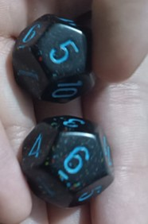
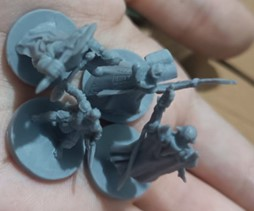
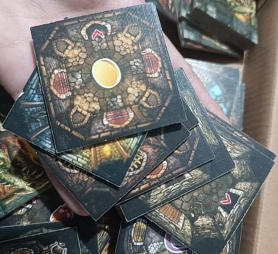

# Development of a Physical Prototype

A first version of the physical game prototype was created using parts from other board games, which were adapted to function in the same way as the original *Más Menos Pingüinos* game.

## Components

### Dice

### Penguin

### Tiles

Additionally, tests were conducted among team members through a gameplay session.

