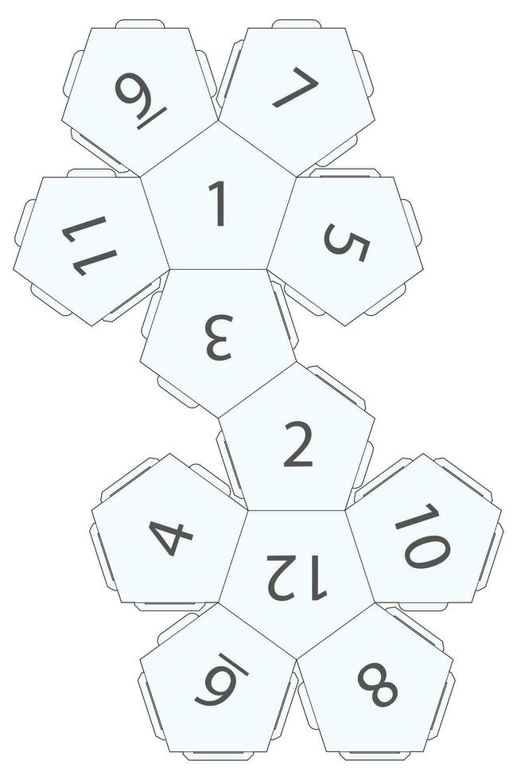
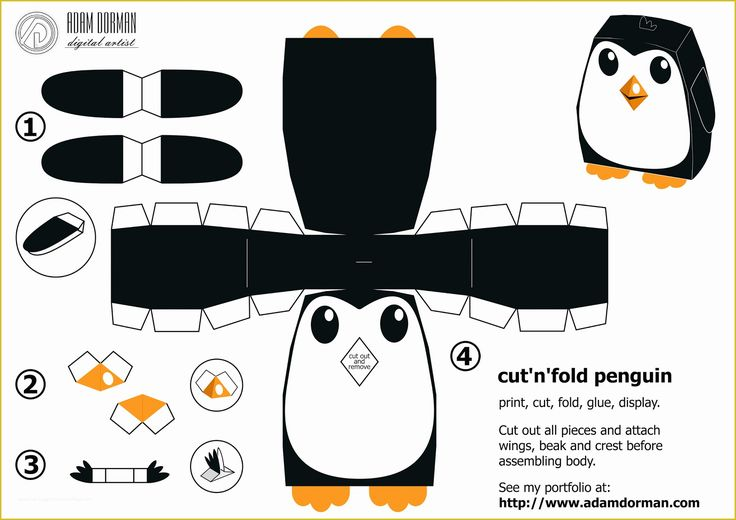
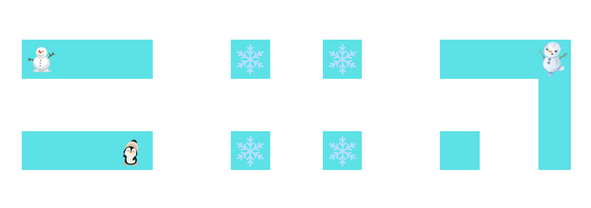

# Development of a second version of a Physical Prototype

A second version of the prototype was created using printable components with more attractive designs, as this version will be tested with children.

## Components

### Dice

### Penguin

### Tiles
